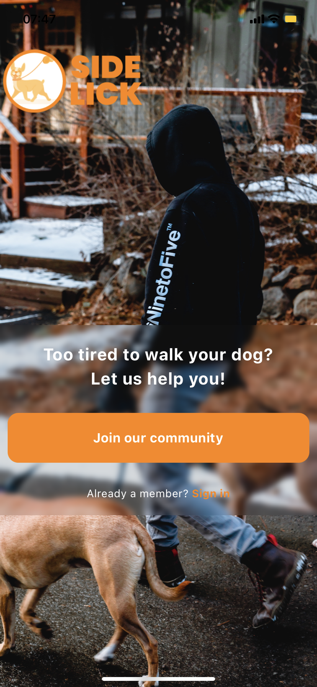
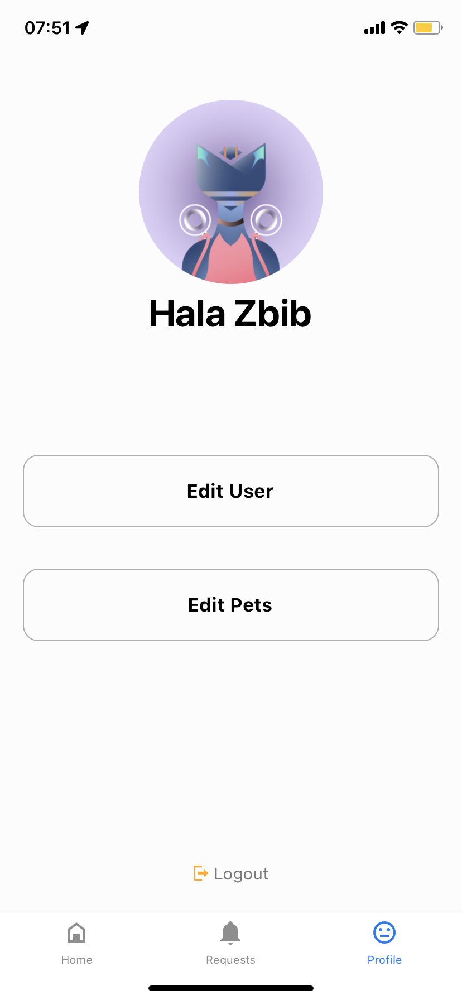
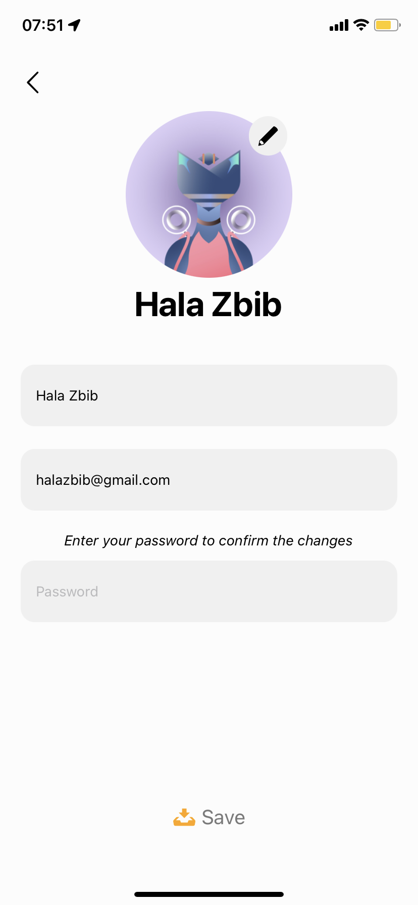

<div align="center">

> Hello world! This is the project’s summary that describes the project plain and simple, limited to the space available.

**[PROJECT PHILOSOPHY](#project-philosophy) • [WIREFRAMES](#wireframes) • [TECH STACK](#tech-stack) • [IMPLEMENTATION](#implementation) • [HOW TO RUN?](#how-to-run)**

</div>

<br><br>


> SideLick is a dog walking app, where clients can simply log in and look for nearby walkers, book them, and contact them via WhatsApp.

### User Stories

- As a user, I want to find a nearby walker, so that I can book them.
- As a user, I want to connect with the walkers, so that I can exchange more information.
- As a user, I want to change my profile, so that I can show exact information about me.

<br><br>


- This design was done on Figma for fine details, using [Figma Material 3 design kit](https://www.figma.com/file/O6uRHx7eLmnOKAyFAnETmA/Final-Project?node-id=0%3A1).

<table>
  <tr>
    <td></td>
    <td></td>
    <td></td>
    <td></td>
  </tr>
  <tr>
    <td></td>
    <td></td>
    <td></td>
    <td></td>
  </tr>
</table>


Here's a brief high-level overview of the tech stack SideLick uses:

- This project uses the [React Native framework](https://reactnative.dev/). React Native combines the best parts of native development with React, a best-in-class JavaScript library for building user interfaces.
- For persistent storage (database), the app uses the [MongoDB](https://www.mongodb.com/) package. With a document data model that maps to how developers think and code and a powerful, unified query API, MongoDB powers faster, more flexible application development.
- The app uses [Expo](https://docs.expo.dev/). Expo is a framework and a platform for universal React applications. It is a set of tools and services built around React Native and native platforms that help you develop, build, deploy, and quickly iterate on iOS, Android, and web apps from the same JavaScript/TypeScript codebase.
- The app uses [Cloudinary](https://cloudinary.com/documentation) for image upload. Cloudinary provides a secure and comprehensive API for easily uploading assets from server-side code, directly from the browser or from a mobile application.

<br><br>


> Using the above mentioned tech stacks and the wireframes built with figma from the user stories we have, the implementation of the app is shown as below, these are screenshots from the real app.

<table>
  <tr>
    <td></td>
    <td></td>
    <td></td>
    <td></td>
  </tr>
  <tr>
    <td></td>
    <td></td>
    <td></td>
    <td></td>
  </tr>
</table>

<br><br>


> To get a local copy up and running follow these simple example steps.

### Prerequisites

* Download and install [Node.js](https://nodejs.org/en/)

* npm
  ```sh
  npm install npm@latest -g
  ```
* Expo CLI
  ```sh
  npm install --global expo-cli
  ```
* Expo Go app for iOS and Android  

  > 🤖 [Android Play Store](https://play.google.com/store/apps/details?id=host.exp.exponent) - Android Lollipop (5) and greater.  
  > 🍎 [iOS App Store](https://apps.apple.com/app/expo-go/id982107779) - iOS 11 and greater.

### Installation

1. Clone the repo
   ```sh
   git clone https://github.com/HalaZbib22/SideLick.git
   ```
2. Navigate to the Frontend folder and install dependencies
   ```sh
   cd SideLick/Frontend
   npm install
   ```
3. Run the start up command
   ```sh
   expo start
   ```
4. Scan the generated QR code with your camera (ios) or through the Expo Go application (android)


