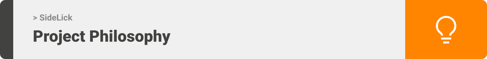
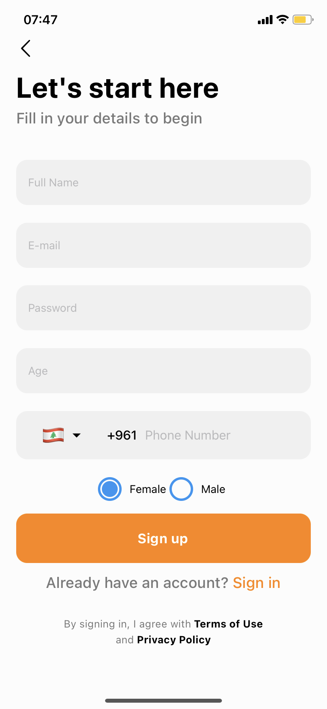

<div align="center">

> Hello world! SideLick is a dog walking app, where clients can simply log in and look for nearby walkers, book them, and contact them via WhatsApp.

**[PROJECT PHILOSOPHY](https://github.com/HalaZbib22/SideLick---Frontend-react-native-#project-philosophy) • [WIREFRAMES](https://github.com/HalaZbib22/SideLick---Frontend-react-native-#wireframes) • [TECH STACK](https://github.com/HalaZbib22/SideLick---Frontend-react-native-#tech-stack) • [IMPLEMENTATION](https://github.com/HalaZbib22/SideLick---Frontend-react-native-#-impplementation) • [HOW TO RUN?](https://github.com/HalaZbib22/SideLick---Frontend-react-native-#how-to-run)**

</div>

<br><br>




### User Stories
- As a user, I want to find a nearby walker, so that I can book them.
- As a user, I want to connect with the walkers, so that I can exchange more information.
- As a user, I want to change my profile, so that I can show exact information about me.

<br><br>


> This design was planned before on paper, then moved to Figma app for the fine details.
Note that i didn't use any styling library or theme, all from scratch and using pure css modules

<br><br>


Here's a brief high-level overview of the tech stack SideLick uses:

- This project uses the [React Native framework](https://reactnative.dev/). React Native combines the best parts of native development with React, a best-in-class JavaScript library for building user interfaces.
- For persistent storage (database), the app uses the [MongoDB](https://www.mongodb.com/) package. With a document data model that maps to how developers think and code and a powerful, unified query API, MongoDB powers faster, more flexible application development.
- The app uses [Expo](https://docs.expo.dev/). Expo is a framework and a platform for universal React applications. It is a set of tools and services built around React Native and native platforms that help you develop, build, deploy, and quickly iterate on iOS, Android, and web apps from the same JavaScript/TypeScript codebase.


<br><br>


> Uing the above mentioned tecch stacks and the wireframes build with figma from the user sotries we have, the implementation of the app is shown as below, these are screenshots from the real app





<br><br>


> This is an example of how you may give instructions on setting up your project locally.
To get a local copy up and running follow these simple example steps.

### Prerequisites

This is an example of how to list things you need to use the software and how to install them.
* npm
  ```sh
  npm install npm@latest -g
  ```

### Installation

_Below is an example of how you can instruct your audience on installing and setting up your app. This template doesn't rely on any external dependencies or services._

1. Get a free API Key at [https://example.com](https://example.com)
2. Clone the repo
   ```sh
   git clone https://github.com/your_username_/Project-Name.git
   ```
3. Install NPM packages
   ```sh
   npm install
   ```
4. Enter your API in `config.js`
   ```js
   const API_KEY = 'ENTER YOUR API';
   ```


